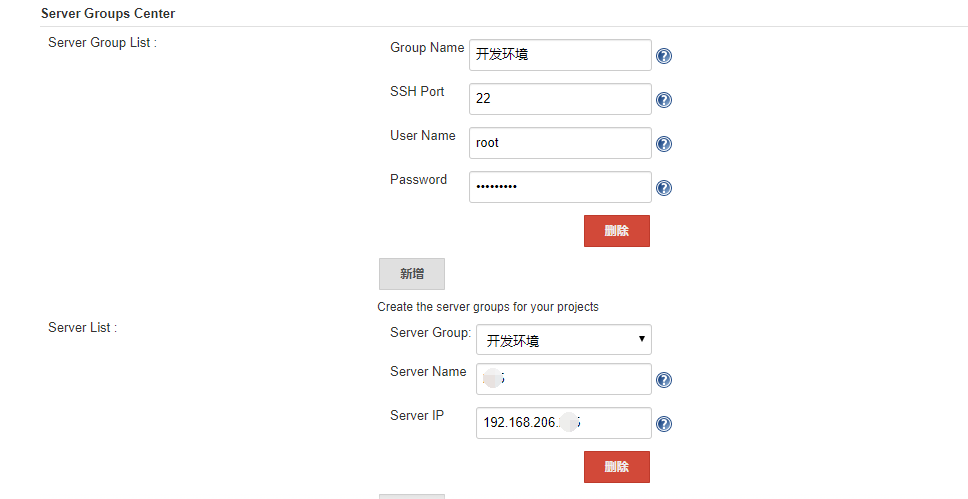

= *[underline]##Jenkins 自动化部署##*
doc writer <wyudi@qq.com>
v0.1, 2019-03-13
:toc: right
:imagesdir: images
:homepage: http://asciidoctor.org

<<<

== **什么是jenkins**

---
=== Jenkins 定义
====
jenkins是一个运行在Java环境里的持续集成工具。通过jenkins可以构建一个平台，用于完成重复性的工作，并使这项工作简单化。

====

[[plugin]]
=== Jenkins 自动化部署分支到服务器
====

* 完成自动化部署需要的plugin
----
	
Maven Integration plugin：构建一个maven项目
Publish Over SSH：将maven打好的包上传至远程服务器
SSH2 Easy Plugin：上传jenkins所在的服务器的文件上传至远程服务器
Subversion Plug-in：集成SVN做源码下载等工作
----
* Publish Over SSH/SSH2 Easy Plugin 这两个插件在功能上有一定的重叠的，但是publish over ssh上传文件的时候简单的使用绝对路径，默认上传文件时是能使用相对于当前工作区的路径。这里我们事先自动化部署的时候是将shell放在jenkins 服务器上的任意位置的，所以用ssh2 easy plugin较为方便。
* 如果需要集成github/gitee需要增加对应的插件
====

[[global-config]]
=== Jenkins 部分配置
* 全局属性设置

image::global-properties.png[全局属性]

* ssh2easy配置

* publish over ssh配置(内网的话建议使用root,坑少)

image::publish-over-ssh.png[publish over ssh配置]

* 插件
====
----

Maven Integration plugin：构建一个maven项目
Publish Over SSH：将maven打好的包上传至远程服务器
SSH2 Easy Plugin：上传jenkins所在的服务器的文件上传至远程服务器
Subversion Plug-in：集成SVN做源码下载等工作
----
* Publish Over SSH/SSH2 Easy Plugin 这两个插件在功能上有一定的重叠的，但是publish over ssh上传文件的时候简单的使用绝对路径，默认上传文件时是能使用相对于当前工作区的路径。这里我们事先自动化部署的时候是将shell放在jenkins 服务器上的任意位置的，所以用ssh2 easy plugin较为方便。
* 如果需要集成github/gitee需要增加对应的插件
====
* shell脚本

TIP: 本shell脚本最好默认放在/var/lib/jenkins/shell路径下
====
.app.shell
[source%nowrap,bash]
----
#!/bin/bash

source /etc/profile
echo "脚本执行啦"  `date` $0 $1 $2 $3 $4
SpringBoot=$2 //<1>
port=$3 //<1>
debugPort=$4 //<1>

if [ "$1" = "" ];
then
    echo -e "未输入操作名 {start|stop|restart|status}"
    exit 1
fi

if [ "$SpringBoot" = "" ];
then
    echo -e "未输入应用名 "
    exit 1
fi

function start()
{
    count=`ps -ef |grep java|grep $SpringBoot|grep -v grep|wc -l`
    if [ $count != 0 ];then
        echo "$SpringBoot is running..."
    else
        echo "Start $SpringBoot success..."
        BUILD_ID=dontkillme nohup java -agentlib:jdwp=transport=dt_socket,server=y,suspend=n,address=$debugPort -Dserver.port=$port -jar $SpringBoot > log.txt &
        #这里的sleep不能省略，省略之后是无法启动项目的。原因未知！！很坑
        sleep 2s //<2>
    fi
}

function stop()
{
    echo "Stop $SpringBoot"
    boot_id=`ps -ef |grep java|grep $SpringBoot|grep -v grep|awk '{print $2}'`
    count=`ps -ef |grep java|grep $SpringBoot|grep -v grep|wc -l`

    if [ $count != 0 ];then
        kill $boot_id
        count=`ps -ef |grep java|grep $SpringBoot|grep -v grep|wc -l`

        boot_id=`ps -ef |grep java|grep $SpringBoot|grep -v grep|awk '{print $2}'`
        kill -9 $boot_id
    fi
}

function restart()
{
    stop
    sleep 2
    start
}

function status()
{
    count=`ps -ef |grep java|grep $SpringBoot|grep -v grep|wc -l`
    if [ $count != 0 ];then
        echo "$SpringBoot is running..."
    else
        echo "$SpringBoot is not running..."
    fi
}

case $1 in
    start)
    start;;
    stop)
    stop;;
    restart)
    restart;;
    status)
    status;;
    *)

    echo -e " Usage:  $0  {start|stop|restart|status}  {SpringBootJarName}    Example:   $0  start test.jar "
esac
----
<1> 这里必须将 `$3` `$4` 等变量赋值给一个shell内的变量，不然在 start函数内拼接port的时候如果直接使用`$3`,是无法获取到值的，拼接的是空字符串。
<2> 设置里的sleep 不能省略，省略之后nohup java -jar xx.jar这个任务就会随着jenkins命令的结束而结束。
====

* **踩坑**

. publish over ssh 插件 sources files里无论填写的路径是绝对路径(eg:/usr/aa/bb/aa.sh)还是相对路径(aa/bb/aa.sh)这个插件在处理的时候都是按照相对路径来处理的，基准路径为当前项目的workspace.
. shell脚本里start方法，如果不加sleep，那么在jenkins执行shell完毕以后仍然会将其子任务(nohup java -jar xxx.jar)终结掉。
* 任务类型
. 对于任务类型无论是选择“自由风格的软件项目”、“maven项目”都是可以完成构建的，只不过需要执行的流程或者步骤有细微的差别。尝试一下即可。
. 本示例使用的任务类型是“maven项目”配置总览如下：
====
image::job-test.png[任务配置]
====
<<<
